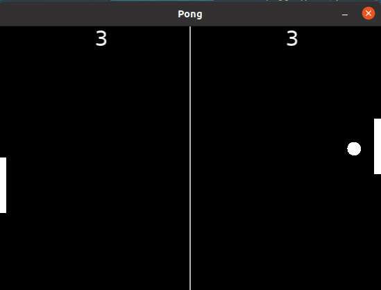

# Make Pong with Lua and Love

## Run it

Make sure to have Love installed.
Install it from https://love2d.org

### Linux

1. Clone repository

   git clone https://github.com/Zeljko-Predjeskovic/LuaPong.git

2. Go into project

   cd LuaPong

3. Run it

   love .

### Windows

Install Love2d and drag project folder into the exe file

### Screenshot

